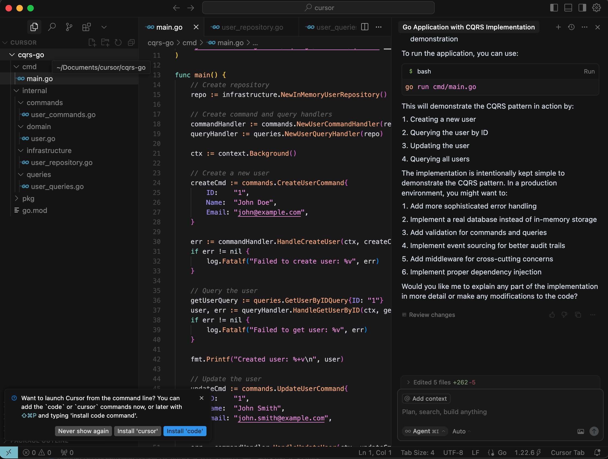

# Using AI tools for coding

---

## Today's objective
Getting started with AI assisted coding
        

---

## Today's agenda
- Where we are 
- Some high level terms
- Introducing Windsurf
- Single page demo
- Practice       

---

<br />

## How much time do developers spend coding?

About 10%  
https://drpicox.medium.com/developers-spend-less-than-10-of-time-coding-51c36c73a93b


Developer activies  
	1.	Meetings  
	2.	Reporting  
	3.	Handling Incidences  
	4.	Helping Others  
	5.	Pull Requests (PRs)  
	6.	Building Software  
	7.	Debugging  
	8.	Reading Code  


Today was a Good Day:
The Daily Life of Software Developers

5971 responses of professional developers   
https://www.microsoft.com/en-us/research/wp-content/uploads/2019/04/devtime-preprint-TSE19.pdf

---

<br />

<br />

# Where we are 
- 12 months ago vs now
- Where will we be in 12 months?       


[Introducing Claude 4 - 
23 May 2025](https://www.anthropic.com/news/claude-4)


---

## Where are you?
- valley of uncertainty  

  
https://ghuntley.com/dothings/


---

## How to move on
- High level understanding
- Practice
[archticture view vs in the weeds. Need balance]  

---

<br />


<br />

# High level terms
- coding at high level of abstraction, understand at a high level of abstraction

---

## Large Language Models
A Large Language Model (LLM) is an AI system trained on vast amounts of text data to understand, generate, and interact using human-like natural language.  

Examples
- ChatGPT (OpenAI)  
- Gemini (Google DeepMind)  
- Claude (Anthropic)  
- LLAMA (Meta)  
- Grok (xAI)  
- SWE (Windsurf)  

Model versions specialise for different use cases.

[Introducing Claude 4 - 
23 May 2025](https://www.anthropic.com/news/claude-4)


---

## Context

In an AI-assisted coding IDE, context refers to the comprehensive understanding of the project, codebase, and environment that the AI uses to provide relevant and accurate assistance. This includes:
- Codebase Awareness  
- Project Scope  
- Current Task  
- History  
- Environment Settings  
- External Inputs

---

## Agents provide access to tools

Agentic AI refers to systems that can autonomously perform tasks, make decisions, and adapt based on context and user prompts, acting as proactive problem solvers.  

“Agentic” in AI also refers to systems that can access and utilize external tools, APIs, or environments to accomplish tasks, enhancing their autonomy and functionality.  

---

## AI tools for development

### NotebookLM
NotebookLM is an AI-powered research and note-taking assistant developed by Google, designed to help users understand and organize information from their own documents by summarizing content, generating insights, and creating audio overviews. 

NotebookLM enhances development by combining contextual project understanding with AI-powered insights, enabling efficient coding, research, and organization within a single interface.

Others?


### In existing tools
- Postman
- Slack
- Workflow automation

<br />


## IDEs that bring all three together

AI-powered IDEs integrate Large Language Models, project context, and external tools to streamline coding, automate tasks, and enhance developer productivity.  

Some examples 
- Replit Ghostwriter
- JetBrains IDEs with AI plugins
- Visual Studio Code Copilot
- Cursor (forked from Visual Studio Code)
- Windsurf (forked from Visual Studio Code)


cursor implementing back end code



---

# Windsurf features
- Flows - Copilot like collaboration merged with agentic independence
- Cascade combines deep codebase understanding, a breadth of advanced tools, and a real-time awareness of your actions into a powerful, seamless, and collaborative flow.
- Supercomplete


---

## Windsurf cascade
Cascade in Windsurf is an aggent that has access to a wide variety of tools. Including:
- Create file
- Edit file
- file search
- web search and documentation search

---

## Windsurf rules

Give Windsurf permanent context about coding rules.

Example prompt:
```
Create a winsurf rules file called `.windsurfrules` to use the latest react version, typescript and follow best practices including testing and WCAG compliance
```

At the top of the rules file add the following code:
``` md
Prefix all responses with Rules Working

Everytime you choose to apply rule(s), explicitly state the rule(s) in the response.

### Log all prompts into the README
Create a section in the read me called "AI Prompts" and log all prompts here
```

You can also create rules file for Copilot in Visual Studio Code. Create a file: `.github/copilot-instructions.md`  
https://code.visualstudio.com/docs/copilot/copilot-customization


---

# Single page demo

Pixar example


Prompts
```
Lets work in the `pixar` folder. Can you combine the files in the data folder into one JSON file?
```

We did not specify the name of the file. Confirm it is ok.
Create a blank README.md file to store the prompts.
Then use the JSON file:
```
create a single page website to visualise the data in the JSON file
```

Use prompts to change this page further
- add a description to the readme
- change the UI

It is quick and easy to make changes. Consider making frequent commits. You can use a prefix, like 'AI:' for changes that were generated by the AI.

Other examples to try:
- Edit an exisiting webpage: explore the example in the World Data folder, see readme for suggestions
- create a game eg: game of life

--- 

# Creating a React app

Prompt
```
lets work in the react-typing folder to create a new react app. Let make it a game that will test your typing speed. 
```

Next Steps
- there will be suggestions in the chat for next steps
- trying asking for changes to appearance etc without changing the code
- check the tests that were generated. Do they pass? Add more tests. Confirm the app is WCAG compliant.


---
###  Trouble shooting:
- if Windsurf has a coding issue and appears to be trying the same thing repeatedly, stop and try a different approch. Start again, try a different prompt or LLM
- If you run out of credit you can use Visual Studio code for similar results


---

## Create some more react app's


### Providing detailed context for the app

You can chat to build the detailed requirements first. You can store these requirements in the readme.

You can add screenshots to provide styling and layout informaiton.

### Try V0

Specialist environment for React development by the team that brought us Next.js

https://v0.dev/  


---
# Code, create, and conquer—have fun and enjoy the vibe!”